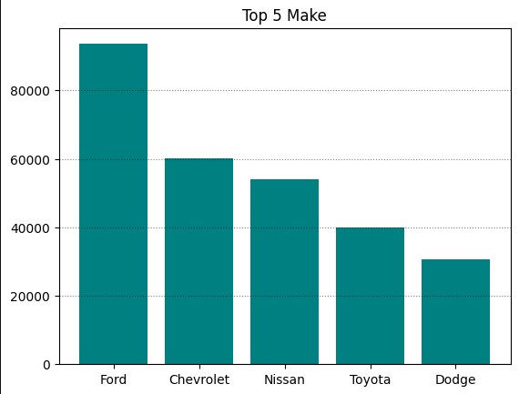
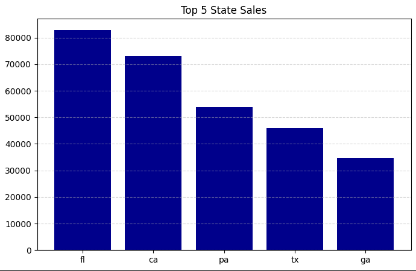
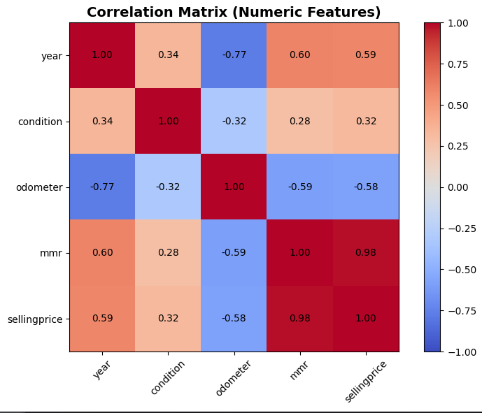
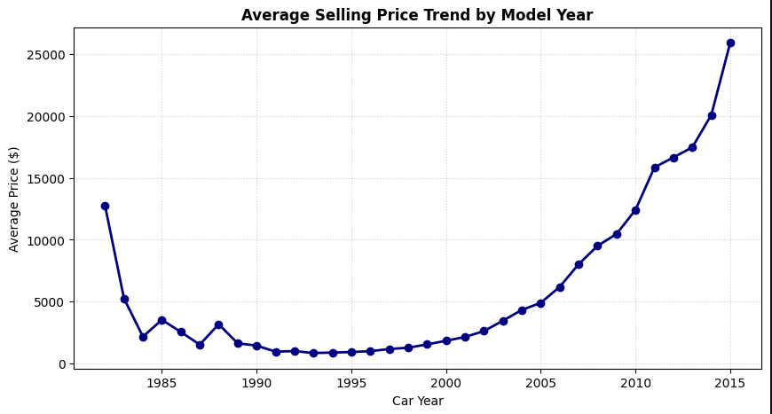
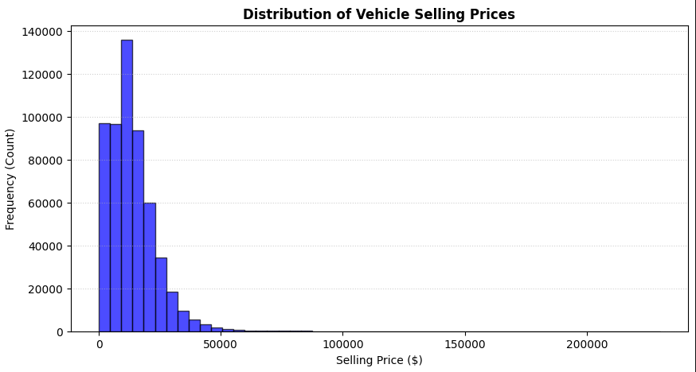
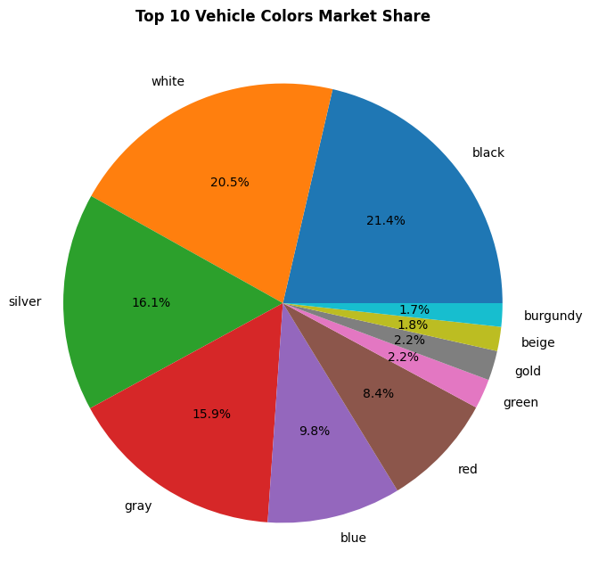
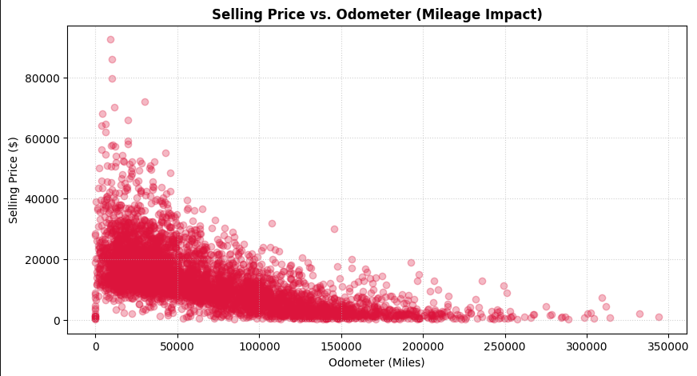

# Task 3: Vehicle Sales Data Visualization

This project was developed as part of the **CodeAlpha Data Analytics Internship** program. The main goal of this task is to transform raw vehicle sales data (`car_prices.csv`) into meaningful visual representations using Python libraries, uncover market trends, and deliver data-driven insights.

----

## 📌 Project Objectives

* Transform raw vehicle sales datasets into clear visual formats.
* Utilize **Matplotlib** and **Pandas** to construct informative and aesthetic charts.
* Analyze relationships between vehicle sales price, odometer mileage, manufacture year, and make.
* Build a compelling data story to support business decision-making.

----

## 🛠️ Tech Stack & Tools

* **Python**
* **Pandas** — Data manipulation and aggregation
* **Matplotlib** — Data visualization and layout customization

----

## 📊 Key Visualizations & Findings

### 1. Top 5 Vehicle Makes

* **Chart Type:** Bar Chart
* **Insight:** Identifies the most frequent vehicle brands in the market (Ford, Chevrolet, Nissan, Toyota, Dodge). `Ford` leads the market in overall listings.

----

### 2. Regional Sales Distribution (Top 5 States)

* **Chart Type:** Bar Chart
* **Insight:** Highlights top sales regions (`FL`, `CA`, `PA`, `TX`, `GA`), with Florida and California showing the highest sales volumes.

----

### 3. Feature Correlation Matrix

* **Chart Type:** Heatmap
* **Insight:** 
  * Strong positive correlation (**0.98**) between `sellingprice` and `mmr` (Manheim Market Report value).
  * Moderate negative correlation (**-0.58**) between `odometer` and `sellingprice` (higher mileage decreases sale price).

----

### 4. Price Trend by Model Year

* **Chart Type:** Line Plot
* **Insight:** Demonstrates a significant upward trend in average selling prices for newer models, particularly those manufactured post-2010.

----

### 5. Distribution of Vehicle Selling Prices

* **Chart Type:** Histogram
* **Insight:** Shows a right-skewed price distribution, indicating that the majority of vehicles are sold within the $0 – $30,000 price range.

----

### 6. Market Share by Vehicle Color

* **Chart Type:** Pie Chart
* **Insight:** Neutral colors dominate market share: **Black (21.4%)**, **White (20.5%)**, **Silver (16.1%)**, and **Gray (15.9%)**.

----

### 7. Mileage Impact on Price (Selling Price vs. Odometer)

* **Chart Type:** Scatter Plot
* **Insight:** Visualizes the depreciation curve—vehicles with low mileage retain higher values, while prices stabilize at lower points as mileage exceeds 100k miles.

----

## 💡 Business Takeaways

1. **Pricing Drivers:** Market value (`mmr`) and vehicle mileage (`odometer`) are the primary determinants of final vehicle selling prices.
2. **Inventory Strategy:** High-demand inventory consists predominantly of newer models with neutral exterior colors (Black/White/Silver) and low mileage.
